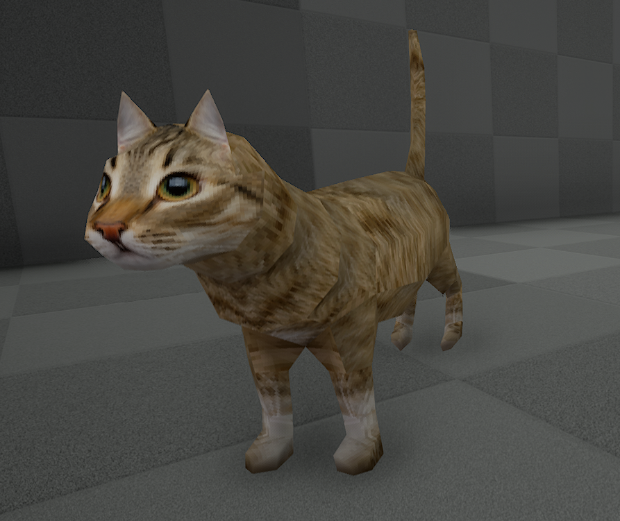
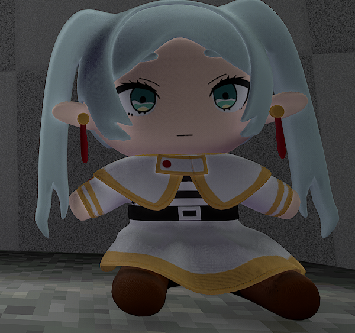

<h1>
Gibb's VotV printer models
</h1>

Models:

<ul>
<li><a href="https://github.com/GibberishDev/votv-model-ports?tab=readme-ov-file#ps1-cat">PS1 Cat</a></li>
<li><a href="https://github.com/GibberishDev/votv-model-ports?tab=readme-ov-file#friren-plush">Friren Plush</a></li>
</ul>

<h2>PS1 Cat</h2>
</img>
 
<h3>
PS1 cat model by <a href="https://sketchfab.com/wersaus33"> Wersaus33 </img></a>  
Printable: <a href="https://github.com/GibberishDev/votv-model-ports/blob/main/Cat%20PS1.zip">zip file</a>  
Printable material: MEAT  
Includes:
<ul>
<li>Diffuse texture</li>
</ul>
</h3>

<h2>Friren Plush</h2>
</img>
 
<h3>
Friren plush by <a href="https://sketchfab.com/Gintoki1234"> Gintoki1234 </img></a>  
Printable: <a href="https://github.com/GibberishDev/votv-model-ports/blob/main/Friren%20Plush.zip">zip file</a>  
Printable material: Paper  
Includes:
<ul>
<li>Diffuse texture</li>
<li>PBR texture (metallic and roughness)</li>
<li>Normal map texture</li>
</ul>
</h3>
