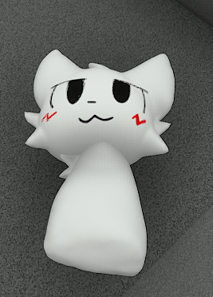
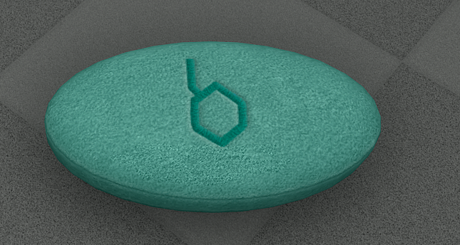
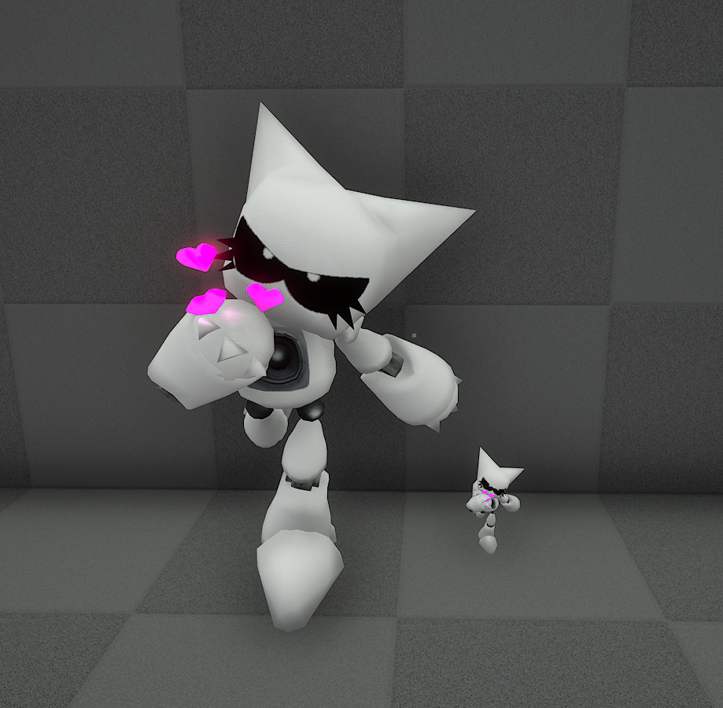
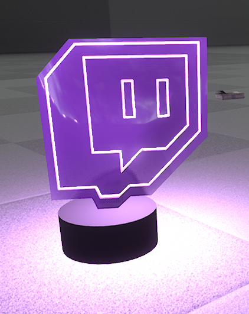

<h1>
Gibb's VotV printer models
</h1>

Description

This a public archive of models i ported to VotV in-game printer. If ya want me to port some model ya have contact me via discord: <a href="https://discordapp.com/channels/@me/624216759993368597/">gibbdev <@624216759993368597></a>

 

Models:

<ul>
<li><a href="https://github.com/GibberishDev/votv-model-ports?tab=readme-ov-file#ps1-cat">PS1 Cat</a></li>
<li><a href="https://github.com/GibberishDev/votv-model-ports?tab=readme-ov-file#friren-plush">Friren Plush</a></li>
<li><a href="https://github.com/GibberishDev/votv-model-ports?tab=readme-ov-file#boykisser">Boykisser</a></li>
<li><a href="https://github.com/GibberishDev/votv-model-ports?tab=readme-ov-file#plush-e">PlushiE</a></li>
<li><a href="https://github.com/GibberishDev/votv-model-ports?tab=readme-ov-file#token">Token</a></li>
<li><a href="https://github.com/GibberishDev/votv-model-ports?tab=readme-ov-file#twith-lamp">Twith Lamp</a></li>
</ul>

<h2>PS1 Cat</h2>
</img>
 
<h3>
PS1 cat model by <a href="https://sketchfab.com/wersaus33"> Wersaus33 </img></a>  
Printable: <a href="https://github.com/GibberishDev/votv-model-ports/blob/main/Cat%20PS1.zip">zip file</a>  
Printable material: MEAT  
Includes:
<ul>
<li>Diffuse texture</li>
</ul>
</h3>

<h2>Friren Plush</h2>
</img>
 
<h3>
Friren plush by <a href="https://sketchfab.com/Gintoki1234"> Gintoki1234 </img></a>  
Printable: <a href="https://github.com/GibberishDev/votv-model-ports/blob/main/Friren%20Plush.zip">zip file</a>  
Printable material: Paper  
Includes:
<ul>
<li>Diffuse texture</li>
<li>PBR texture (metallic and roughness)</li>
<li>Normal map texture</li>
</ul>
</h3>

<h2>Boykisser</h2>
</img>
 
<h3>
Boykisser model by <a href="https://sketchfab.com/emocatorwhatever"> totally not a furry </img></a>  
Printable: <a href="https://github.com/GibberishDev/votv-model-ports/blob/main/boykisser.zip">zip file</a>  
Printable material: ALUMINUM  
Includes:
<ul>
<li>Diffuse texture</li>
</ul>
</h3>

<h2>Plush E</h2>
</img>
 
<h3>
PS1 cat model by <a href="https://sketchfab.com/carboncopycat"> CarbonCopyCat </img></a>  
Printable: <a href="https://github.com/GibberishDev/votv-model-ports/blob/main/plushiE.zip">zip file</a>  
Printable material: PAPER  
Includes:
<ul>
<li>Diffuse texture</li>
</ul>
</h3>

<h2>Token</h2>
</img>
 
<h3>
Metal Token model by <a href="https://sketchfab.com/t0gygoober"> t0gygoober </img></a>  
Printable: <a href="https://github.com/GibberishDev/votv-model-ports/blob/main/MetalToken.zip">zip file</a>  
Includes TWO models: Full size and tabletop. Both models emit light(aka lamp)  
Printable material: METAL  
Includes:
<ul>
<li>Diffuse texture</li>
<li>Emissive texture</li>
</ul>
</h3>

<h2>Twith Lamp</h2>
</img>
 
<h3>
Twitch lamp model by <a href="https://sketchfab.com/jgispertcajidos"> jgispertcajidos </img></a>  
Printable: <a href="https://github.com/GibberishDev/votv-model-ports/blob/main/Twith%20Lamp.zip">zip file</a>  
Printable material: GLASS  
Model is a lamp  
Includes:
<ul>
<li>Diffuse texture</li>
<li>Emissive texture</li>
</ul>
</h3>
